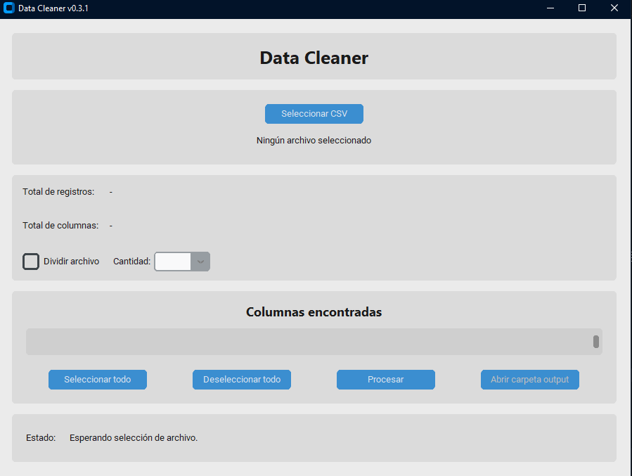

# Data Cleaner

Herramienta de escritorio desarrollada en Python para limpiar y preparar archivos CSV y Excel mediante una interfaz gráfica.

<p align="center">
  
</p>

## Funcionalidades

- Seleccionar archivos CSV y Excel (`.csv`, `.xlsx` y `.xls`).
- Detectar automáticamente la codificación y el separador de archivos CSV.
- Mostrar total de registros y columnas.
- Seleccionar qué columnas exportar.
- Renombrar columnas antes de exportar.
- Reordenar columnas con los botones ▲ / ▼.
- Dividir el archivo en 2 a 5 partes.
- Validación de nombres vacíos o duplicados.
- Confirmación antes de sobrescribir archivos existentes.
- Abrir la carpeta `output/` desde la interfaz.

## Requisitos

- Python 3.10 o superior

## Instalación

1. Clona el repositorio:

```bash
git clone https://github.com/ZaCtox/data-cleaner.git
cd data-cleaner
```

2. Crea y activa un entorno virtual (recomendado):

```bash
python -m venv .venv

# Windows
.venv\Scripts\activate

# Linux / macOS
source .venv/bin/activate
```

3. Instala las dependencias:

```bash
pip install -r requirements.txt
```

## Uso

### Desde Python

```bash
python main.py
```

1. Haz clic en **Seleccionar archivo** y elige el CSV o Excel.
2. Marca o desmarca las columnas que quieras conservar.
3. Renombra columnas si lo necesitas.
4. Usa **Seleccionar todo** / **Deseleccionar todo** si lo necesitas.
5. Opcional: activa **Dividir archivo** para generar varias partes.
6. Haz clic en **Procesar**.
7. Usa **Abrir carpeta output** para ver los resultados.

El archivo resultante se guarda en la carpeta `output/` con el nombre `{nombre_original}_limpio.csv`.

### Ejecutable (.exe)

Para generar un `.exe` liviano con solo las dependencias necesarias:

```powershell
.\build.ps1
```

Esto crea un entorno virtual limpio (`.venv-build/`), instala las
dependencias de ejecución y compilación, y genera el ejecutable con
PyInstaller.

El ejecutable queda en:

```
dist\DataCleaner.exe
```

Para usarlo, ejecuta:

```powershell
.\dist\DataCleaner.exe
```

Los CSV procesados se guardan en `output/` **junto al .exe** (puedes mover `DataCleaner.exe` a otra carpeta; se creará `output/` ahí).

## Estructura del proyecto

```
data_cleaner/
├── main.py                  # Punto de entrada
├── config.py                # Configuración de la aplicación
├── build.ps1                # Script para generar el .exe
├── DataCleaner.spec         # Configuración PyInstaller
├── ui/
│   └── main_window.py       # Interfaz gráfica
├── processors/
│   └── csv_processor.py     # Lógica de procesamiento CSV
├── models/
│   └── column.py            # Modelo de columna
├── output/                  # Archivos generados (ignorado por git)
└── requirements.txt
```

## Tecnologías

- [Python](https://www.python.org/)
- [Pandas](https://pandas.pydata.org/)
- [CustomTkinter](https://github.com/TomSchimansky/CustomTkinter)
- [PyInstaller](https://pyinstaller.org/)

## Historial de cambios

Consulta el archivo [CHANGELOG.md](CHANGELOG.md) para conocer el historial de versiones y las mejoras incorporadas en cada actualización.

## Licencia

Este proyecto está bajo la licencia MIT. Consulta el archivo [LICENSE](LICENSE) para más detalles.

## Roadmap

- [x] Limpieza de CSV
- [x] Soporte para Excel
- [x] División de archivos
- [ ] Perfiles para Mailjet
- [ ] Vista previa de datos
- [ ] Reordenamiento mediante Drag & Drop
